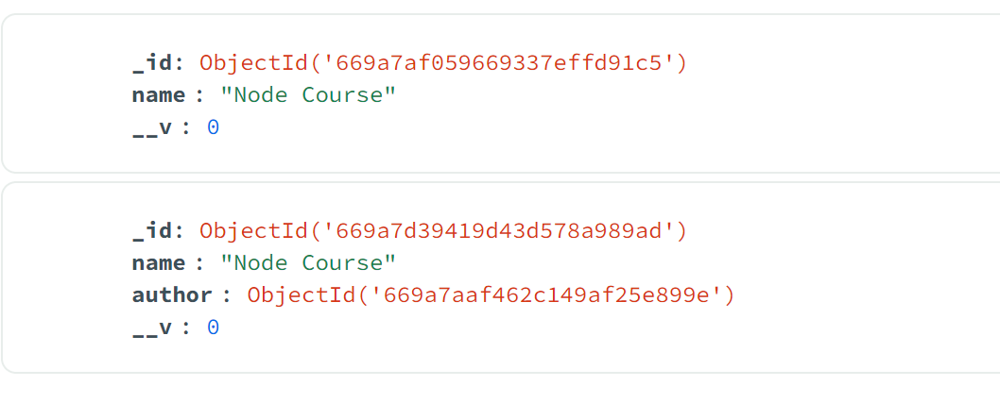

const Author = mongoose.model(
"Author",
new mongoose.Schema({
name: String,
bio: String,
website: String,
})
);

const Course = mongoose.model(
"Course",
new mongoose.Schema({
name: String,
author: {
type: mongoose.Schema.ObjectId,
ref: "Author",
},
})
);

In the given Mongoose schema definition for the `Course` model, the following lines:

author: {
type: mongoose.Schema.ObjectId,
ref: "Author",
},

we got reference to the author document added to the Course document:

The lines are specifying a reference to another model, Author, in MongoDB. Here's a detailed explanation of what these lines mean:

type: mongoose.Schema.ObjectId:

This specifies that the author field in the Course schema is of type ObjectId.
ObjectId is a special type in MongoDB used for unique identifiers of documents. It is a 12-byte identifier typically used as the primary key in a MongoDB document.
ref: "Author":

This indicates that the author field references the Author model.
In Mongoose, ref is used to establish a relationship between two schemas. By setting ref to "Author", Mongoose knows that the ObjectId stored in the author field corresponds to a document in the Author collection.
Combining these two lines, the author field in the Course schema is defined as an ObjectId that references a document in the Author collection. This is how Mongoose sets up a relationship between the Course and Author models, enabling you to perform operations like population, where you can easily fetch the related Author document when querying a Course document.
